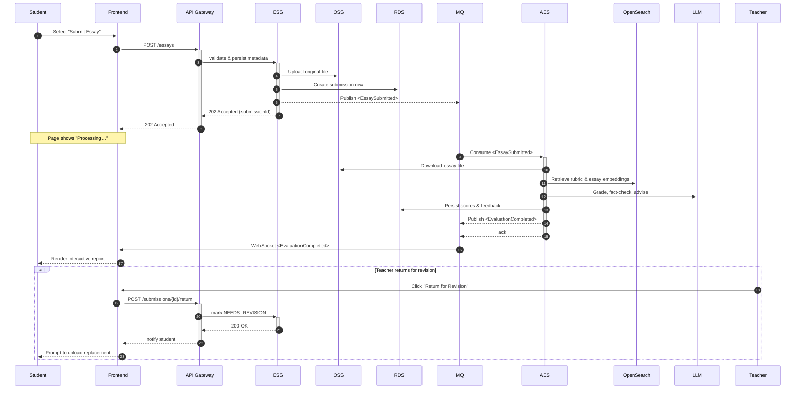
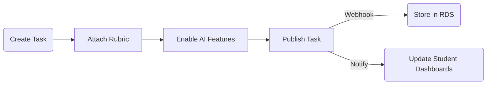
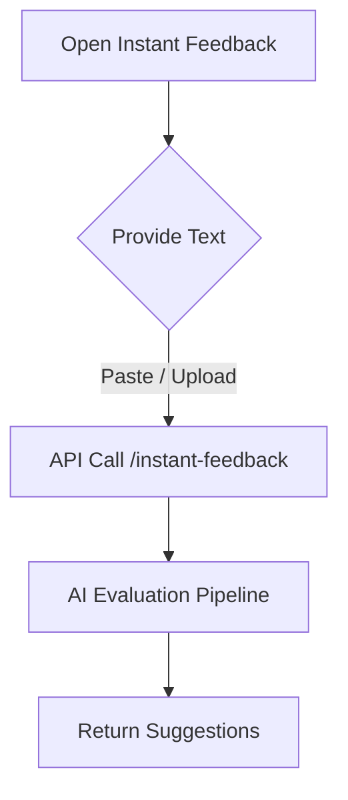
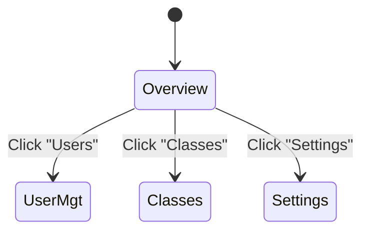

# EssayCoach Business Process Workflow

## 1. Purpose
This document formalises, in developer-friendly language, the **end-to-end business flow** of the EssayCoach platform.  It clarifies which actor does *what* and *when*, forming the baseline for API design, event contracts, and acceptance tests.

## 2. Actors & Responsibilities
| Actor | Responsibility |
|-------|---------------|
| **Student** | Submits a single essay per task, reviews AI reports, performs inline edits after grading; may replace submission only if teacher returns it. |
| **Teacher** | Creates tasks, defines rubrics, monitors progress, issues final grades. |
| **Administrator** | Manages users, global settings, feature toggles, compliance. |
| **Frontend (Next.js App)** | Collects user input, renders dashboards, orchestrates client-side state. |
| **API Gateway** | Single public entry-point; enforces authN/Z, throttling and routing. |
| **Microservices** | UMS, ESS, AES, ARS… perform domain logic (see functional-module doc). |
| **Async Processing** | MVP: Django async views + PostgreSQL. Future: Redis + Celery for scalable queueing. |
| **Datastores** | PostgreSQL (relational), OSS (files), OpenSearch (vectors). |

## 3. High-Level End-to-End Flow

## 4. Detailed Sub-Flows
### 4.1 Task Lifecycle (Teacher-Centric)

### 4.2 Instant Feedback (Student-Centric)

*Instant Feedback* bypasses the formal Task entity but reuses the same AI evaluation stack with a generic rubric.

### 4.3 Admin Oversight

## 5. Error Handling & Retry Strategy
* **Gateway 4xx:** Validation errors returned synchronously; frontend surfaces inline.
* **ESS Storage Failure:** Automatic retry (3× exponential back-off).  On permanent failure, submission is marked `FAILED` and notification sent.
* **MQ Dead-Letter:** Messages exceeding retry policy are routed to <DLQ>; operators alerted via CloudMonitor.

## 6. Audit & Compliance Notes
Every state-changing event (task create, essay submit, evaluation complete, grade override) is appended to an **Event Store** table with userId, timestamp, and payload hash, enabling full traceability for research & GDPR requests.

---
*Document version: 1.0*  
*Last updated: 2025-06-29* 
