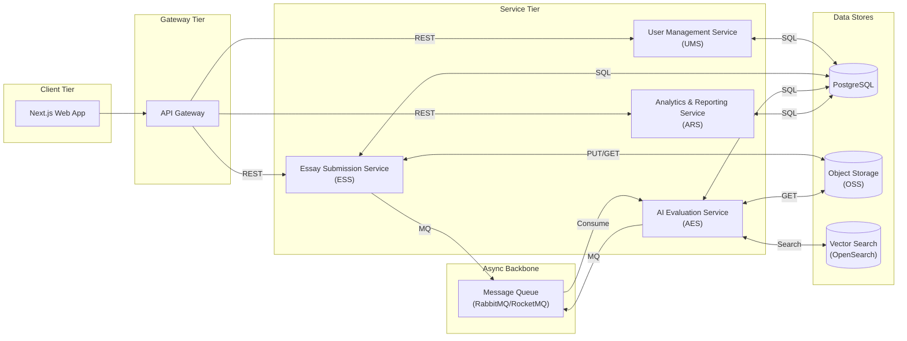
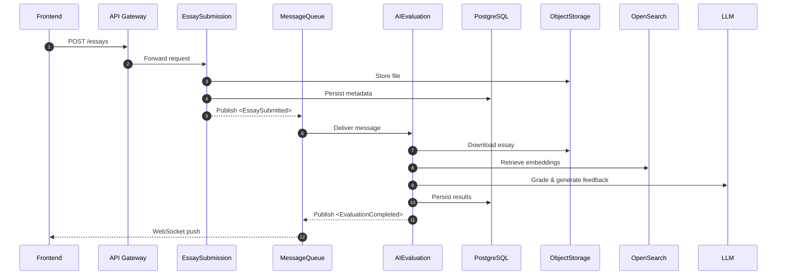

# EssayCoach Functional Module Design

## 1. Scope
This document decomposes the EssayCoach platform into discrete **functional modules** (microservices, shared libraries, and infrastructure components).  The goal is to provide a clear, implementation-ready reference for developers, DevOps engineers, and QA teams.

## 2. Module Landscape

### Module Responsibilities
| Module | Language | Key Responsibilities | External Dependencies |
|--------|----------|----------------------|-----------------------|
| **UMS** | Python (FastAPI) | Authentication, RBAC, profile CRUD | PostgreSQL |
| **ESS** | Python (FastAPI) | File upload, submission metadata, publish `<EssaySubmitted>` | OSS, MQ, PostgreSQL |
| **AES** | Python (FastAPI Workers) | Ingest queue messages, run grading/fact-check/advice, publish `<EvaluationCompleted>` | OSS, OpenSearch, LLM provider, PostgreSQL |
| **ARS** | Python (FastAPI) | Aggregated metrics, anonymised exports, dashboards APIs | PostgreSQL |
| **API Gateway** | N/A (Managed) | Routing, authZ, rate-limiting, caching | JWT, OAuth2 provider |
| **MQ** | Redis + Celery (future) / Django async (MVP) | Asynchronous processing | — |
| **OSS** | Alibaba OSS | Essay file storage | — |
| **PostgreSQL** | ApsaraDB RDS | Relational data | — |
| **OpenSearch** | ApsaraDB OpenSearch | Vector similarity search | — |

## 3. Sequence: Essay Evaluation Happy Path

## 4. Error & Timeout Handling
1. **Submission Timeout** – ESS returns `504 Gateway Timeout`, *but* still retries uploading to OSS up to 3 times.
2. **AI Worker Failure** – AES emits `<EvaluationFailed>`; ESS updates submission status to `FAILED`. Frontend shows red toast.
3. **OpenSearch Unavailable** – AES falls back to heuristic grading and logs a `WARN`.

## 5. Extensibility Guidelines
* New features should be added **vertically** (new microservice) rather than bloating existing ones.
* All inter-service events must be **versioned** (e.g., `v1.EssaySubmitted`).
* Shared code resides in the `packages/shared/` monorepo workspace to avoid duplication.

---
*Document version: 1.0*  
*Last updated: 2025-06-29*                            