```mermaid
graph LR
    StudentHome["🏠 Dashboard"] --> TaskList["📋 My Tasks"]
    TaskList --> EssayCoach["🤖 Essay Coach"]
    EssayCoach --> Progress["📊 My Progress"]
    Progress --> Profile["👤 Profile"]
```

# EssayCoach Platform Navigation System Design

## 1. Purpose & Scope
This document describes the comprehensive UI/UX design specifications for the navigation system used throughout the EssayCoach desktop web application:

1. **Top Bar (Header)** – Global actions, brand identity & contextual tools.
2. **Side Bar (Primary Navigation)** – Context-aware hierarchical menu.
3. **Floating Action Buttons (FABs)** – Context-sensitive quick actions that overlay content.

The design decisions are grounded in the functional requirements laid out in:
* `EssayCoach Platform Core Features and User Experience Flow.md`
* `EssayCoach Platform Summary.md`
* `EssayCoach Platform Technical Project Summary.md`

## 2. High-level Layout Overview


**Layout Principles:**
* **Top Bar** – Fixed header with contextual content.
* **Side Bar** – Collapsible navigation drawer.
* **FABs** – Floating context-sensitive actions that adapt to the current page/user role.

## 3. Top Bar (Header)

### 3.1 Layout Structure
The top bar provides global identity, primary navigation, and access to universal tools.

| Zone | Width | Elements | Behavior |
|------|-------|----------|----------|
| **Left** | `Auto` | • Logo + EssayCoach wordmark | Acts as a "home" button, linking to the user's role-specific dashboard. |
| **Center**| `flex-1` | • Primary Navigation Links | A set of role-specific text links for navigating to core platform modules. |
| **Right** | `Auto` | • Notifications (🔔) <br/> • User avatar dropdown | Persistent utility icons and user menu. The dropdown contains links to Profile, Settings (if applicable), Help, and Logout. |

*Note: Breadcrumbs, if needed, will be displayed below the top bar and above the main content area to provide page context without cluttering the main navigation.*

### 3.2 Top Bar Navigation Design
The primary navigation links in the center of the top bar are dynamically displayed based on the user's role. These links provide quick access to the most frequently used sections of the platform.

#### Student Navigation
| Link Text | Router Link | Description |
|-----------|-------------|-------------|
| Dashboard | `/dashboard` | The student's main landing page with task overviews. Accessed via the Logo. |
| Tasks | `/tasks` | Navigates to the "My Tasks" page, listing all assigned essays. |
| Essay Coach | `/essay-coach` | Opens the AI writing assistant for on-demand guidance and analysis. |

#### Teacher Navigation
| Link Text | Router Link | Description |
|-----------|-------------|-------------|
| Dashboard | `/dashboard` | The teacher's main landing page with class overviews and activity. Accessed via the Logo. |
| Tasks | `/tasks` | Navigates to the "Task Management" page to create and oversee tasks. |
| Classes | `/classes` | Navigates to a page for managing classes and student rosters. |
| Rubrics | `/rubrics` | Opens the library for creating and managing grading rubrics. |

#### Administrator Navigation
| Link Text | Router Link | Description |
|-----------|-------------|-------------|
| Dashboard | `/admin/dashboard` | The admin's main landing page with system-wide metrics. Accessed via the Logo. |
| Users | `/admin/users` | Navigates to the "User Management" module. |
| Classes | `/admin/classes` | Navigates to the "Class Management" module. |
| Tasks | `/admin/tasks` | Provides an overview of all tasks across the platform. |
| Settings | `/admin/settings`| Opens the "System Settings" panel. |

## 4. Side Bar (Primary Navigation)

### 4.1 Architecture & States
The sidebar operates in two distinct modes based on user preference:


| State | Width | Visibility | Trigger |
|-------|-------|------------|---------|
| **Expanded** | `280px` | Icons + labels + nested menus | Default |
| **Collapsed** | `72px` | Icons only + tooltips | User toggle |

### 4.2 Content Structure


### 4.3 Role-Based Navigation Menus

#### Student Navigation


#### Teacher Navigation


```mermaid
graph LR
    TeacherHome["🏠 Dashboard"] --> TaskMgmt["📝 Task Management"]
    TaskMgmt --> Rubrics["📏 Rubrics"]
    Rubrics --> Students["👥 Students"]
    Students --> Analytics["📊 Analytics"]
    Analytics --> Profile["👤 Profile"]
```

#### Admin Navigation

```mermaid
graph LR
    AdminHome["🏠 Dashboard"] --> Users["👥 User Management"]
    Users --> Classes["🏫 Classes"]
    Classes --> GlobalRubrics["📏 Global Rubrics"]
    GlobalRubrics --> Features["⚙️ Feature Toggles"]
    Features --> Logs["📋 System Logs"]
    Logs --> Profile["👤 Profile"]
```


### 4.4 Interactive Behaviors
- **Hover Expansion**: In collapsed mode, hovering reveals temporary expanded view.
- **Active State**: Current route highlighted with brand accent color and subtle background.
- **Badge Indicators**: Notification badges on relevant menu items (new AI reports, pending tasks).
- **Keyboard Navigation**: Full arrow key navigation with Enter/Space activation.
- **Persistent State**: Collapse preference saved in local storage.

## 5. Floating Action Buttons (FABs)

### 5.1 Context-Sensitive FAB System
FABs provide immediate access to the most important action for the current context, adapting based on user role and current page.


### 5.2 Role-Based FAB Configurations

#### Student FABs
| Context | Primary FAB | Secondary Actions | Behavior |
|---------|-------------|-------------------|----------|
| **Dashboard** | ➕ New Submission | • Quick Feedback<br/>• View Tasks | Speed dial on tap |
| **Task List** | 📝 Start Writing | • Filter Tasks<br/>• Search | Single action |
| **Task Detail** | 📤 Submit Essay | • Save Draft<br/>• Preview | Conditional visibility |
| **Instant Feedback** | ⚡ Analyze Text | • Paste from clipboard<br/>• Upload file | Dynamic based on input |
| **Results View** | 🔄 Revise Essay | • Download Report<br/>• Share Results | Context menu |

#### Teacher FABs
| Context | Primary FAB | Secondary Actions | Behavior |
|---------|-------------|-------------------|----------|
| **Dashboard** | ➕ Create Task | • Import Rubric<br/>• Quick Analytics | Speed dial menu |
| **Task Management** | 📝 New Task | • Duplicate Task<br/>• Bulk Actions | Expandable options |
| **Student View** | 💬 Add Comment | • Grade Override<br/>• Send Message | Quick feedback tools |
| **Analytics** | 📊 Export Data | • Generate Report<br/>• Schedule Export | Data action menu |
| **Rubric Editor** | 💾 Save Rubric | • Preview<br/>• Test with Sample | Version control |

#### Admin FABs
| Context | Primary FAB | Secondary Actions | Behavior |
|---------|-------------|-------------------|----------|
| **Dashboard** | ⚙️ Quick Setup | • Add Users<br/>• System Health | Admin utilities |
| **User Management** | 👤 Add User | • Bulk Import<br/>• Export List | User operations |
| **System Logs** | 🔍 Search Logs | • Export Logs<br/>• Clear Old | Log management |

### 5.3 FAB Animation & Interaction Patterns


### 5.4 FAB Behavior
- **Position**: Fixed position `bottom: 24px, right: 24px`.
- **Keyboard Navigation**: Focusable and activatable via Enter/Space.

## 6. Theming & Visual Design System

### 6.1 Color Palette Application


### 6.2 Elevation & Shadows
| Component | Elevation | Shadow Value |
|-----------|-----------|--------------|
| **Top Bar** | `z-index: 1000` | `0 1px 3px rgba(0,0,0,0.1)` |
| **Sidebar** | `z-index: 900` | `2px 0 8px rgba(0,0,0,0.1)` when expanded |
| **Primary FAB** | `z-index: 1100` | `0 4px 12px rgba(0,0,0,0.15)` |
| **Secondary FABs** | `z-index: 1050` | `0 2px 8px rgba(0,0,0,0.1)` |

### 6.3 Animation & Transitions
- **Sidebar collapse/expand**: `300ms ease-in-out`
- **FAB hover effects**: `150ms ease-out`
- **Badge notifications**: `100ms bounce effect`

## 7. Implementation Guidelines

### 7.1 Component Architecture
```
src/layouts/
├── header/
│   ├── AppHeader.tsx (main header component)
│   ├── components/
│   │   ├── BreadcrumbNav.tsx
│   │   ├── GlobalSearch.tsx
│   │   ├── NotificationBell.tsx
│   │   └── UserDropdown.tsx
├── sidebar/
│   ├── AppSidebar.tsx (main sidebar component)
│   ├── components/
│   │   ├── NavMenuItem.tsx
│   │   ├── CollapseToggle.tsx
│   │   └── QuickActions.tsx
└── fab/
    ├── FloatingActionButton.tsx
    ├── SpeedDial.tsx
    └── FABManager.tsx (context-aware controller)
```

### 7.2 State Management Integration
- **Sidebar state**: `state/app.ts` → `sidebarCollapsed`, `sidebarWidth`
- **Navigation state**: `state/navigation.ts` → `activeRoute`, `breadcrumbs`
- **FAB state**: `state/fab.ts` → `activeFABs`, `fabContext`
- **Notification state**: `state/notification.ts` → `unreadCount`, `alerts`

### 7.3 Accessibility Requirements
- **ARIA labels**: All navigation elements properly labeled
- **Keyboard navigation**: Full keyboard support (Tab, Arrow keys, Enter, Esc)
- **Screen reader support**: Proper heading hierarchy and landmark roles
- **Focus management**: Clear focus indicators and logical tab order
- **Color contrast**: WCAG AA compliance for all text and interactive elements

## 8. Future Roadmap

### 8.1 Enhanced Features
- **Contextual Search**: AI-powered search in top bar with smart suggestions
- **Multi-tab Support**: Browser-like tab management for power users
- **Notification Center**: Comprehensive notification timeline and management
- **Customizable Navigation**: User-configurable menu items and FAB actions
- **Voice Navigation**: Voice commands for accessibility enhancement

### 8.2 Advanced Interactions
- **Keyboard Shortcuts**: Power user keyboard combinations
- **Context-Aware Suggestions**: ML-driven navigation recommendations

---

*Document Version: 2.1*
*Last Updated: December 2024*
*Next Review: Q1 2025* 