# Agentic Design Plans

This document contains plans and specifications for the agentic design of the EssayCoach platform.

## Overview

The EssayCoach system is designed as a State-Machine-Based Multi-Agent System. Unlike a linear chain, it uses a graph architecture (*LangGraph*) to manage state transitions, enabling cyclical reasoning, self-correction, and parallel execution. The core philosophy is "**Trust but Verify,**" specifically applied via a *Corrective RAG (CRAG)* subgraph that ensures every claim in a student's essay is cross-referenced against validated knowledge before feedback is generated.

## Design Principles

1. Parallelism over Sequentialism: To reduce latency, independent analysis tasks (Logic, Language, and Fact-Checking) run concurrently.

2. Cyclical Verification: The fact-checking agent does not just retrieve; it evaluates the quality of retrieval. If the local knowledge base is insufficient, it actively loops back to perform a web search, ensuring high fidelity.

3. Strict State Typing: Data passed between agents is strictly typed (using Pydantic models) to prevent hallucinated data structures and ensure reliable JSON parsing.

4. Modular Sub-Graphing: Complex workflows (like Fact-Checking) are encapsulated as "Sub-Graphs," keeping the main orchestration layer clean and readable.

## Architecture

The high-level architecture consists of a **Main Supervisor Graph** that branches into three distinct analysis nodes. One of these nodes (Fact Checker) acts as a nested state machine.

Component Breakdown
**The Supervisor (State Manager)**: Orchestrates the flow and holds the OverallState (essay content, rubrics, and final reports).

**Agent A (Fact Checker - CRAG Subgraph)**: A dedicated loop for extracting claims, retrieving evidence, and verifying accuracy.

**Agent B (Language Analyst)**: A single-shot LLM node focused on syntax, tone, and style.

**Agent C (Logic Analyst)**: A single-shot LLM node focused on argumentation flow and logical fallacies.

**Agent D (Rubric Extractor)**: A specialized tool-use agent that parses unstructured rubric text into a structured grading schema.

