# API Specification

## 🚀 API Overview

EssayCoach provides a comprehensive RESTful API built with Django REST Framework, designed for educational applications with AI-powered essay feedback capabilities.

## 📋 Authentication

### JWT Token Authentication
```http
POST /api/auth/token/
Content-Type: application/json

{
  "username": "student@example.com",
  "password": "securepassword"
}
```

**Response:**
```json
{
  "access": "eyJ0eXAiOiJKV1QiLCJhbGciOiJIUzI1NiJ9...",
  "refresh": "eyJ0eXAiOiJKV1QiLCJhbGciOiJIUzI1NiJ9...",
  "user": {
    "id": 1,
    "username": "student@example.com",
    "first_name": "John",
    "last_name": "Doe"
  }
}
```

### Token Refresh
```http
POST /api/auth/token/refresh/
Content-Type: application/json

{
  "refresh": "eyJ0eXAiOiJKV1QiLCJhbGciOiJIUzI1NiJ9..."
}
```

## 📊 Core Endpoints

### Essay Management

#### List User Essays
```http
GET /api/essays/
Authorization: Bearer {access_token}
```

**Query Parameters:**
- `status` (optional): pending, processing, completed, failed
- `category` (optional): essay category ID
- `page` (optional): pagination page number
- `page_size` (optional): items per page (default: 20)

**Response:**
```json
{
  "count": 25,
  "next": "http://localhost:8000/api/essays/?page=2",
  "previous": null,
  "results": [
    {
      "id": 1,
      "title": "The Impact of Technology on Education",
      "content": "Essay content here...",
      "category": {
        "id": 1,
        "name": "Technology",
        "description": "Essays about technology and its impact"
      },
      "status": "completed",
      "created_at": "2024-01-15T10:30:00Z",
      "updated_at": "2024-01-15T10:35:00Z",
      "feedback_count": 3,
      "overall_score": 85.5
    }
  ]
}
```

#### Create Essay Submission
```http
POST /api/essays/
Authorization: Bearer {access_token}
Content-Type: application/json

{
  "title": "The Future of AI in Education",
  "content": "Full essay content here...",
  "category": 1,
  "word_count": 1200,
  "academic_level": "undergraduate"
}
```

#### Get Essay Details
```http
GET /api/essays/{id}/
Authorization: Bearer {access_token}
```

#### Update Essay
```http
PUT /api/essays/{id}/
Authorization: Bearer {access_token}
Content-Type: application/json

{
  "title": "Updated Essay Title",
  "content": "Updated content...",
  "category": 2
}
```

### Feedback System

#### Get Essay Feedback
```http
GET /api/essays/{essay_id}/feedback/
Authorization: Bearer {access_token}
```

**Response:**
```json
{
  "count": 3,
  "results": [
    {
      "id": 1,
      "type": "grammar",
      "score": 8.5,
      "max_score": 10,
      "feedback": "Good grammar overall, but watch for comma splices...",
      "suggestions": [
        {
          "original": "However the results were significant.",
          "suggested": "However, the results were significant.",
          "explanation": "Add comma after introductory word"
        }
      ],
      "highlighted_text": "However the results were significant.",
      "start_index": 156,
      "end_index": 189,
      "created_at": "2024-01-15T10:35:00Z"
    }
  ]
}
```

#### Request New AI Feedback
```http
POST /api/essays/{essay_id}/analyze/
Authorization: Bearer {access_token}
```

**Response:**
```json
{
  "message": "AI analysis started",
  "task_id": "550e8400-e29b-41d4-a716-446655440000",
  "estimated_completion": "2024-01-15T10:40:00Z"
}
```

### Analytics Dashboard

#### User Analytics
```http
GET /api/analytics/user/
Authorization: Bearer {access_token}
```

**Response:**
```json
{
  "total_essays": 25,
  "average_score": 82.3,
  "essays_this_month": 5,
  "improvement_trend": "+5.2",
  "categories": {
    "technology": 10,
    "literature": 8,
    "science": 7
  },
  "recent_activity": [
    {
      "date": "2024-01-15",
      "essays_submitted": 2,
      "average_score": 85.5
    }
  ]
}
```

#### Educator Reports
```http
GET /api/analytics/educator/
Authorization: Bearer {access_token}
```

*(Admin/Educator users only)*

## 🔄 API Architecture Flow

### Request Lifecycle
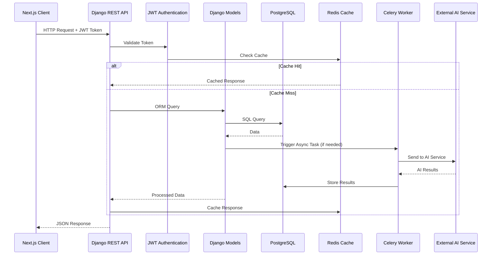

### Authentication Flow
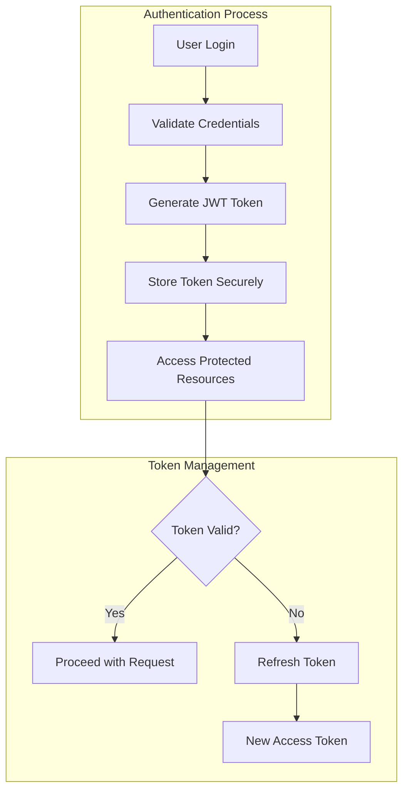

### Essay Submission Flow
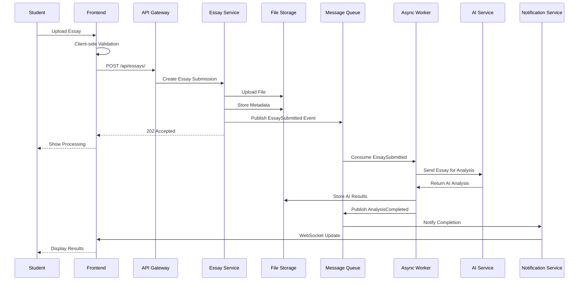

### Feedback System Flow
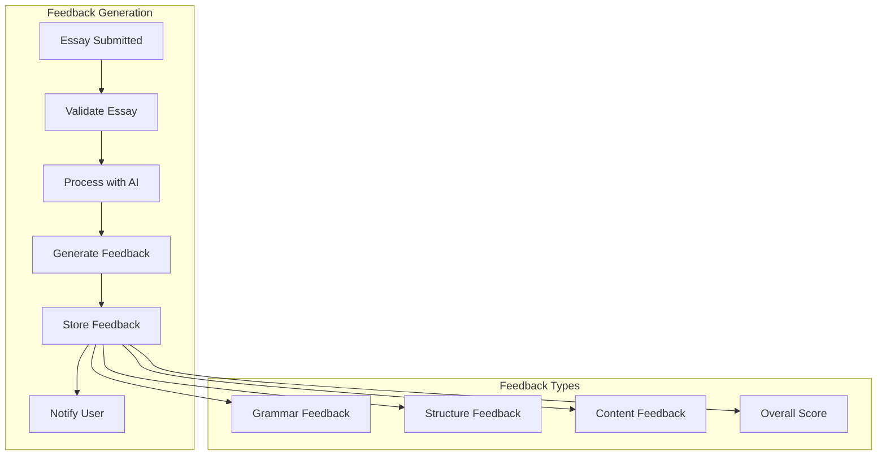

### Real-time Updates Flow
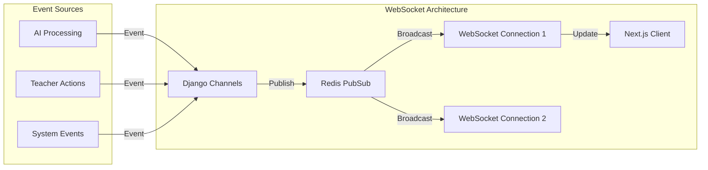

## 🎯 Error Handling Flow

### Error Resolution Flow
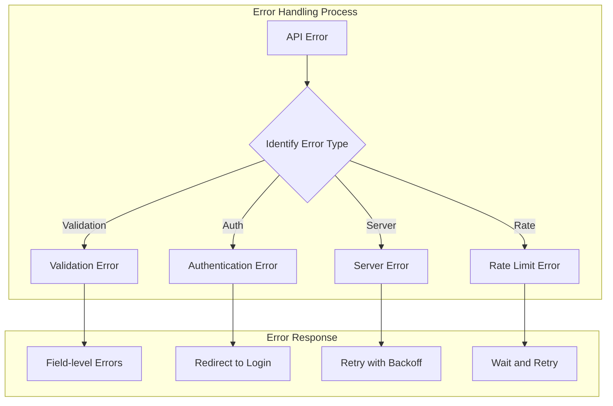

### Rate Limiting Flow
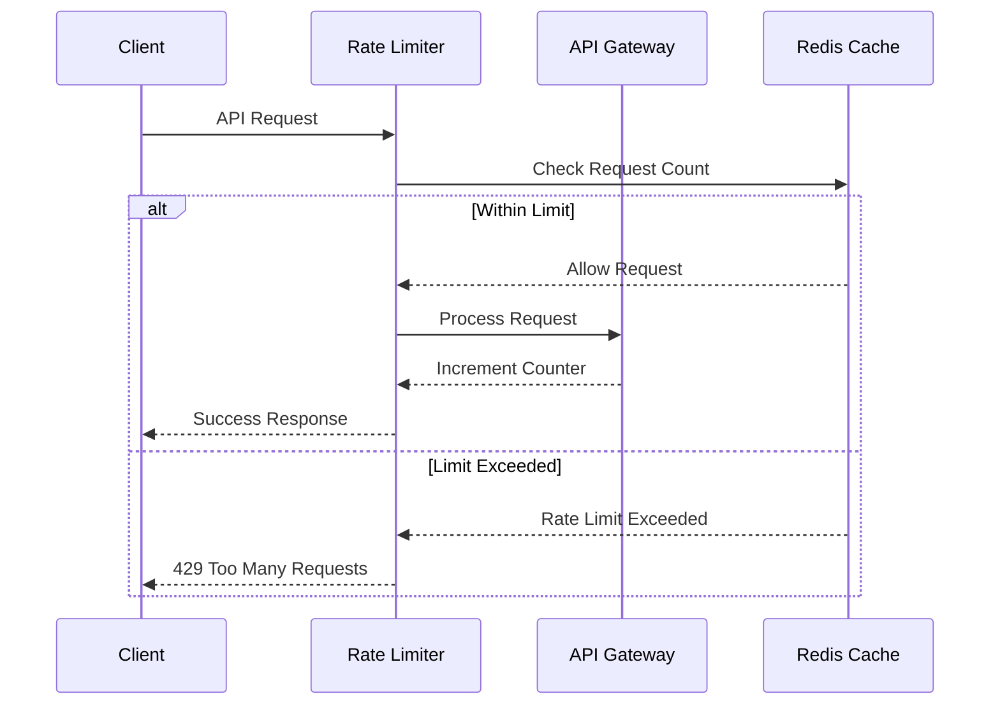

## 📊 Pagination & Filtering Flow

### Pagination Architecture
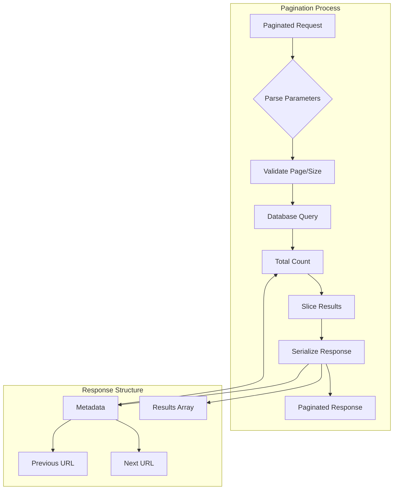

### Filtering Flow
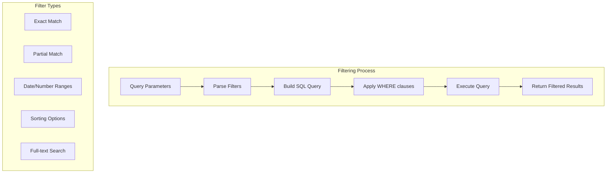

## 🔍 API Documentation Flow

### OpenAPI Generation Flow
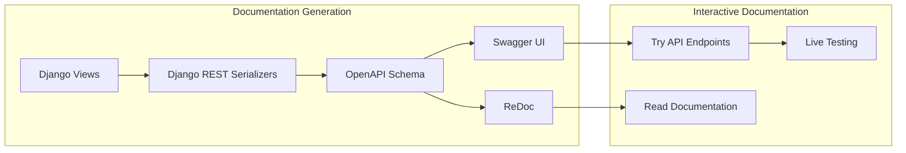

### Testing Workflow
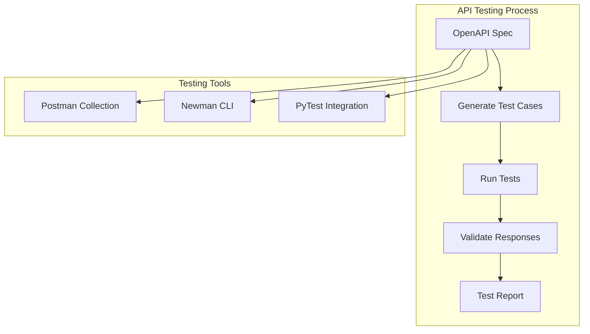

## 🚀 Deployment Flow

### CI/CD Pipeline
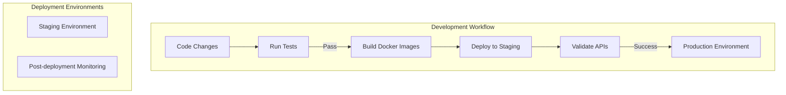