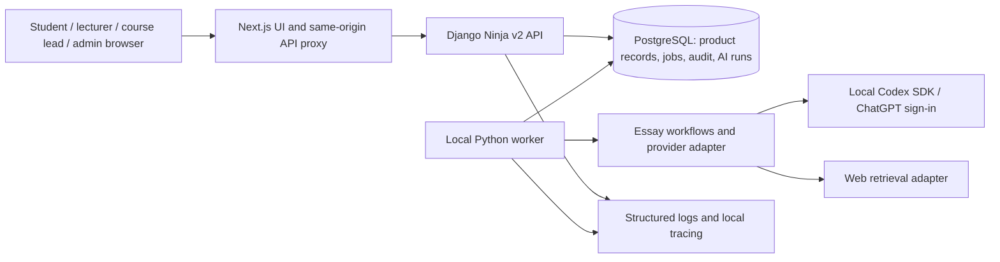

# EssayCoach product architecture

- Status: proposed implementation baseline, 2026-09-25
- Audience: engineers building and reviewing the local product
- Scope: one institution, four user experiences, Chinese and English, all 14 PRDs

This document fixes the boundaries for turning the [interactive prototype](interactive-prototype.md) into a local product. The numbered PRDs in `docs/prd/` remain the feature source of truth; the product decisions already agreed with the owner override older open-registration, Dify, and automatic-grade-publication language in those documents. The code is the source of truth for what works today. [Completion plan](product-completion-plan.md) tracks the implementation order; the [2026-10-01 acceptance record](../development/release-acceptance-2026-10-01.md) records the current verification.

## Initial context and gaps at the start of implementation

The repository already had a Next.js frontend, a Django Ninja v2 API, PostgreSQL models for users/classes/tasks/submissions/rubrics, and an isolated bilingual prototype. At the start of this build, `auth/register/` accepted a client-supplied role, AI analysis defaulted to Dify, and the LangGraph alternative required `OPENAI_API_KEY` with in-process run state. These were baseline observations, not target behavior. The [completion plan](product-completion-plan.md) records subsequent implementation progress.

## Responsibilities and boundaries

| Component | Owns | Does not own |
| --- | --- | --- |
| Next.js | Accessible pages, locale catalogs, client validation, same-origin proxy, session presentation | Authorization decisions, scores, durable jobs |
| Django Ninja v2 | Identity, role and ownership checks, domain commands, workflow transitions, OpenAPI contracts | Long-running model calls inside request transactions |
| PostgreSQL | Users, teaching setup, drafts, submissions, evidence, AI runs, grade history, audit events, job leases | Unverified model claims as authoritative grades |
| Python worker | Claims durable jobs, executes bounded AI/search work, retries recoverable failures, persists terminal status | Publishing a formal grade |
| AI workflow | Rubric-grounded feedback, claim extraction/verification, proposed score and evidence | Identity, authorization, teacher approval, release |

The first local deployment stays a **modular monolith**. Existing Next.js, Django, and PostgreSQL are retained. No microservice boundary or Redis/Celery dependency is needed for a single institution and one local worker. A PostgreSQL job table with row locking, leases, idempotency keys, and restart recovery is the proposed first queue. Add a dedicated broker only if measurements show that the database queue is inadequate.

## Identity, course scope, and permissions

- Bootstrap the first admin locally. Admins invite staff; a lecturer or authorized course lead invites students into a class. Invitations use single-use, expiring, hashed tokens. The private local build can display a copyable activation link; SMTP can be an optional delivery adapter. Public registration and client-supplied role selection are removed from the product path.
- `student`, `lecturer`, and `admin` remain global account types. **Course lead is a scoped teaching assignment**, not a global account type: a lecturer may lead one course and teach another. The API checks this assignment for each course/class action. Prototype role switching is a preview aid, not a permission source.
- A lecturer who is also that course's lead may review and publish the same submission in v1. These remain two explicit actions with separate audit events and permission checks; they are never an implicit publish on review.
- Authorization is enforced on every Ninja command and query using the authenticated user, class membership, teaching assignment, and ownership. The browser's role value, URL parameters, or an unverified JWT payload never grant access. Keep existing httpOnly cookie, CSRF, and proxy-header protections.
- One institution is configured for v1. Course/class relations form the data boundary. Do not claim multi-tenant isolation until an institution key and filtering exist throughout the schema and queries.

## Teaching and assessment data

- Courses (`Unit`) contain classes; classes contain enrollment and teaching assignments. Assignments (`Task`) reference a **versioned rubric snapshot** at publication/submission time, so later rubric edits cannot silently change historic grading criteria.
- Keep student **practice drafts and feedback** distinct from formal submissions and assessment. Practice feedback is visible to its author immediately. A formal submission creates a separate AI proposal that is visible only to authorized staff until publication.
- Formal assessment is a server-side state machine: `submitted -> ai_pending -> ai_draft -> lecturer_reviewed -> lead_confirmed -> published`. Failure/retry states branch from `ai_pending`; a lecturer may edit scores/comments and resubmit review. Lead confirmation and publication may be one atomic action, but the audit log records both the lead decision and visible release. The student API returns no formal score or feedback before `published`.
- Preserve the initial AI proposal, every human change, actor, timestamp, rubric version, and published result. Scores are checked against criterion maxima and total arithmetic in the domain service, inside database transactions. Concurrent reviewer updates use a version or row lock.
- Social sharing is opt-in, class scoped, and based on an explicitly shared revision. It cannot expose unpublished formal feedback by joining through a submission ID.

## AI and source verification

- The application-facing essay workflow remains provider neutral. A narrower model adapter handles structured generation; separate retrieval and citation-verification adapters handle internet sources. The workflow validates model JSON with Pydantic and persists the normalized result before reporting success.
- The initial **local** model adapter is the Python `openai-codex` SDK using the machine's ChatGPT sign-in and a configurable `gpt-6-luna` model. On 2026-09-25, a bounded local spike confirmed sign-in, a completed Luna call, JSON-schema output, usage metadata, and two concurrent English/Chinese calls. An invalid model raised `RuntimeError`, which the worker must translate into a persisted failed run. The spike did **not** establish cancellation, long-run reliability, or auditable search events. The SDK is documented for Codex automation; suitability for a shared or unattended product runtime must be proven by additional tests before treating it as a deployable service. Do not silently fall back to an API-key provider because the owner ruled that out.
- Formal scoring uses that SDK through `CodexScoringProvider` and a database-backed worker. Practice analysis now uses `CodexPracticeProvider` with immutable draft revisions and a separate durable queue. Source discovery runs in live web-search mode; candidates are independently fetched by the backend, then Luna interprets the bounded excerpts. English and Chinese practice-analysis calls completed locally; a browser test produced a persisted English report and one source-supported claim. This is a first source-verification slice, not a guarantee of broad source coverage or search-event auditability. The installed Python SDK's bundled CLI is older than this machine's Codex configuration; `CODEX_BIN` selects a compatible local runtime. The worker verifies that the active account is a ChatGPT login and does not ask for an API key.
- Run model tasks with a constrained sandbox and no access to the EssayCoach repository or user files. Send only the essay/rubric context needed for the requested analysis. Keep provider threads isolated per job. The backend never exposes SDK credentials to a student browser.
- Fact checking extracts checkable claims, searches the web, fetches the cited source URLs independently, and records source title, URL, retrieval time, excerpt, and a `supported`/`contradicted`/`unresolved` verdict. A URL only returned by the model is **not** sufficient evidence. If retrieval fails, the claim remains unresolved; the feedback says so.
- A local application run independently fetched a NASA page discovered by the live-search turn, persisted its excerpt and matching quote, and marked the relevant claim supported. Another claim in the same run remained unresolved because its source excerpt was insufficient. This is evidence of the end-to-end path, not a general accuracy evaluation.
- The student practice workflow now includes persisted revision chat through `CodexPracticeChatProvider`; one live browser question completed against the local worker. The old Dify analysis/chat/status routes return 410, while retained historical adapter modules have no active API caller. A failed provider or malformed output produces a visible failed run, never a fabricated success.

## Localization and interface integration

- The prototype's visual tokens and journeys guide the real route components. Connect one vertical slice at a time to typed v2 API services, replacing fixture arrays and local-only state. Keep `/prototype` as a design reference until every real page is accepted, then decide whether to remove it.
- Put interface text, validation messages, email/link copy, and status labels in locale catalogs keyed by stable message IDs. English and Simplified Chinese ship together; the active locale lives in a user preference with a browser fallback. The current implementation moved all static two-argument copy calls in active pages into 809 matching catalog entries; 19 calls with dynamic values and some older code remain inline. User-authored essays and stored rubric text are never automatically translated by switching the interface. New locale catalogs can be added without changing domain records, though the two-language preference contract must also be extended.
- The same design system must work for keyboard use, narrow screens, long Chinese text, empty/loading/error states, and all four experiences.

## Observability and operations

- Each API request has a request ID; each AI job has a durable run ID. Carry IDs across API, worker, graph stages, provider call, source retrieval, and saved draft. Store status, actor and scope references, prompt/schema/model versions, timestamps, retries, latency, provider usage when available, and typed failure category. Unknown usage remains null rather than zero.
- Emit structured JSON logs without raw essays, prompts, model responses, invitation tokens, or credentials. Add OpenTelemetry spans for the API and AI stages, exported to a local trace viewer. The database run and audit records remain the authoritative investigation path if telemetry is unavailable.
- A health/readiness check distinguishes frontend, API, PostgreSQL, worker, and model authentication. A local operator can inspect failed jobs, retry safe failures, and identify stuck leases. Database migrations and a documented seed/bootstrap path make `make dev` reproducible.

## Key decisions and trade-offs

1. **Modular monolith over service split:** fastest path with the existing code; it requires disciplined module ownership and query-level permissions.
2. **PostgreSQL worker queue over Redis first:** fewer local services and durable status; throughput is intentionally modest and must be measured.
3. **Scoped course lead over global role:** matches a staff member's differing responsibilities across courses; adds assignment-aware permission checks.
4. **Codex subscription adapter over API-key provider for the private build:** honors the owner's credential choice and passed a basic live call; it carries availability and automation limits that need a gate before formal assessment is enabled.
5. **Independent source retrieval over model citations alone:** gives a reviewable evidence trail; unresolved claims remain explicit.

## Validation gates and known limits

Before enabling the formal AI path, test bilingual structured scoring against a rubric snapshot, independent retrieval of at least one cited source, a provider failure, process restart/status recovery, concurrent runs, and cancellation/timeout behavior. Test server-side permissions for invitation activation, cross-class access, lecturer editing, lead publication, and student pre-publication visibility. Run migrations and an end-to-end browser journey for each role.

The local ChatGPT sign-in is a per-machine dependency. A one-call SDK spike is evidence of local feasibility, not a guarantee of service entitlements, throughput, or future terms. If the runtime gate fails, keep the adapter boundary and report the blocked capability rather than representing fixtures as live AI.

## References

- [Codex SDK](https://learn.chatgpt.com/docs/codex-sdk) and [Codex authentication](https://learn.chatgpt.com/docs/auth) (checked 2026-09-25)
- [Existing AI migration design](agent-migration.md)
- [Prototype handoff](interactive-prototype.md)
- Current implementation: `backend/core/models.py`, `backend/api_v2/`, `backend/ai_feedback/`, `frontend/src/app/`, `frontend/src/service/api/v2/`
