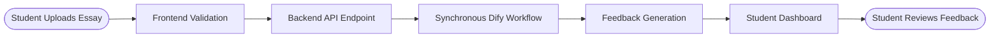

# System Architecture

EssayCoach is built as a modern microservices-ready web application with a clear separation between frontend and backend concerns.

## 🏗️ High-Level Architecture


## 🔧 Technology Stack

### Frontend Architecture
- **Framework**: Next.js 15 with React 19
- **Build Tool**: Next.js (Turbopack) for fast development and optimized builds
- **UI Library**: shadcn/ui (Radix + Tailwind) for consistent design system
- **State Management**: Zustand for predictable state
- **Routing**: Next.js App Router with nested routes
- **HTTP Client**: Axios with interceptors
- **Testing**: Jest for unit tests, Playwright for E2E

### Backend Architecture
- **Framework**: Django 4.x with Django REST Framework
- **Database**: PostgreSQL 14+ with advanced features
- **Async Processing**: Celery + Redis for background tasks
- **Authentication**: JWT tokens with refresh mechanism
- **API**: RESTful endpoints following OpenAPI 3.0
- **Testing**: Pytest with factory-boy for fixtures

### Development Environment
- **Package Management**: uv (Python) and pnpm (Node.js)
- **Database**: PostgreSQL 17 managed via Docker Compose
- **Automation**: Makefile interface for all dev tasks
- **Code Quality**: Ruff, Black, Pyright, Prettier

## 📊 Data Flow Architecture

### Essay Processing Pipeline


### AI Integration Architecture (Current)


## 🚀 Scalability Considerations

### Horizontal Scaling


### Performance Optimizations


## 🔐 Security Architecture

### Authentication Flow


### Data Protection


## 👤 Role-Based Navigation

### Overview

EssayCoach implements role-based navigation to provide users with personalized dashboard experiences based on their role (Student, Lecturer, or Admin). The navigation system filters menu items on the client side using role metadata associated with each navigation item.

### User Roles

| Role      | Description                                  | Typical Users          |
|-----------|----------------------------------------------|------------------------|
| `student` | Can view assignments, submit essays, receive feedback | Enrolled students |
| `lecturer`| Can manage rubrics, view class analytics     | Course instructors, TAs |
| `admin`   | Full system access including user management | System administrators  |

### Navigation Configuration

Navigation items are defined in `frontend/src/constants/data.ts` with a `roles` field that specifies which roles can access each menu item:

```typescript
interface NavItem {
  title: string;
  url: string;
  icon: string;  // Icon identifier from Icons mapping
  isActive: boolean;
  items: NavSubItem[];
  roles?: string[];  // Role-based access control
}

// Example: Rubrics only visible to lecturers and admins
{
  title: 'Rubrics',
  url: '/dashboard/rubrics',
  icon: 'book',
  roles: ['lecturer', 'admin'],
}
```

### Role-Based Menu Matrix

| Menu Item         | Student | Lecturer | Admin |
|-------------------|---------|----------|-------|
| Dashboard         | ✅      | ✅       | ✅    |
| Assignments       | ✅      | ✅       | ✅    |
| Essay Analysis    | ✅      | ✅       | ✅    |
| Rubrics           | ❌      | ✅       | ✅    |
| Library           | ❌      | ✅       | ✅    |
| Analytics         | ❌      | ❌       | ✅    |
| User Management   | ❌      | ❌       | ✅    |

### Backend API: User Classes Endpoint

The frontend retrieves the user's enrolled and assigned classes via a role-aware API endpoint:

**Endpoint**: `GET /api/v1/core/users/me/classes/`

**Response** (Student):
```json
[
  {
    "class_id": 1,
    "unit_name": "Introduction to Computer Science",
    "unit_code": "CS101",
    "class_size": 25
  }
]
```

**Response** (Lecturer):
```json
[
  {
    "class_id": 1,
    "unit_name": "Advanced Essay Writing",
    "unit_code": "ENG301",
    "class_size": 18
  }
]
```

**Response** (Admin):
Returns all classes in the system.

### Implementation Flow


### Class Selection (OrgSwitcher)

Lecturers and students with access to multiple classes can switch between them using the OrgSwitcher component. The selected class context is maintained in the authentication state:

```typescript
// From simple-auth-context.tsx
const { classes, currentClass, setCurrentClass } = useAuth();
// currentClass persists class selection across the session
```

### Related Files

| File                              | Purpose                                      |
|-----------------------------------|----------------------------------------------|
| `frontend/src/constants/data.ts`  | NavItem definitions with roles field         |
| `frontend/src/components/layout/app-sidebar.tsx` | Sidebar with role-based filtering |
| `frontend/src/components/layout/simple-auth-context.tsx` | Auth state management |
| `backend/core/views.py`           | UserClassesViewSet with role-based filtering |
| `backend/core/serializers.py`     | UserClassSerializer for class data           |

## 🧪 Testing Strategy

### Testing Architecture


### Performance Testing


## 📈 Monitoring & Observability

### Monitoring Architecture


### Infrastructure Monitoring
