# System Architecture

EssayCoach is built as a modern microservices-ready web application with a clear separation between frontend and backend concerns.

## 🏗️ High-Level Architecture

## 🔧 Technology Stack

### Frontend Architecture
- **Framework**: Next.js 15 with React 19
- **Build Tool**: Next.js (Turbopack) for fast development and optimized builds
- **UI Library**: shadcn/ui (Radix + Tailwind) for consistent design system
- **State Management**: Zustand for predictable state
- **Routing**: Next.js App Router with nested routes
- **HTTP Client**: Axios with interceptors
- **Testing**: Jest for unit tests, Playwright for E2E

### Backend Architecture
- **Framework**: Django 4.x with Django REST Framework
- **Database**: PostgreSQL 14+ with advanced features
- **Async Processing**: Celery + Redis for background tasks
- **Authentication**: JWT tokens with refresh mechanism
- **API**: RESTful endpoints following OpenAPI 3.0
- **Testing**: Pytest with factory-boy for fixtures

### Development Environment
- **Package Management**: Nix flakes for reproducible environments
- **Database**: Local PostgreSQL with automatic setup
- **Process Management**: Overmind for concurrent services
- **Code Quality**: Black, Flake8, MyPy, Prettier

## 📊 Data Flow Architecture

### Essay Processing Pipeline

```mermaid
flowchart LR
    Start([Student Uploads Essay]) --> Validation[Frontend Validation]
    Validation --> API[Backend API Endpoint]
    API --> Storage[Database Storage]
    Storage --> Async[Async AI Analysis]
    Async --> Generation[Feedback Generation]
    Generation --> Updates[Real-time Updates]
    Updates --> Dashboard[Student Dashboard]
    Dashboard --> Review([Student Reviews Feedback])
```

### AI Integration Architecture

## 🚀 Scalability Considerations

### Horizontal Scaling

### Performance Optimizations

## 🔐 Security Architecture

### Authentication Flow

### Data Protection

## 🧪 Testing Strategy

### Testing Architecture

### Performance Testing

## 📈 Monitoring & Observability

### Monitoring Architecture

### Infrastructure Monitoring
